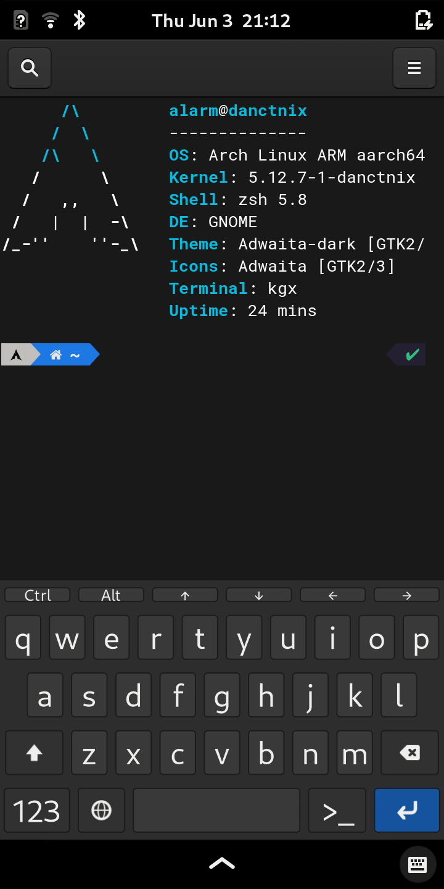

# Dotfiles 

## Sway:


Add ons:

- waybar
- swaylock
- swayidle
- wofi
- mako
- wob
- sworkstyle

Instructions for installation [here](https://github.com/fcarp10/archlinux-install) 

## Phosh:

|      &nbsp;      |      &nbsp;      |
| :--------------: | :--------------: |
|  |  |

Instructions for installation [here](https://github.com/fcarp10/danctnix-install) 


## Dotfiles configuration

1. Create the dotfiles folder in `$HOME` and add an alias to `bash` or `zsh`:
   

    ```shell
    git init --bare $HOME/.dotfiles
    alias config='/usr/bin/git --git-dir=$HOME/.dotfiles/ --work-tree=$HOME'
    config config --local status.showUntrackedFiles no
    echo "alias config='/usr/bin/git --git-dir=$HOME/.dotfiles/ --work-tree=$HOME'" >> $HOME/.zshrc
    ```


2. Add files and commit the changes:
   

    ```shell
    config status
    config add .zshrc
    config commit -m "Add zshrc"
    config push
    ```


3. Apply configuration to existing installation:

    ```shell
    echo "alias config='/usr/bin/git --git-dir=$HOME/.dotfiles/ --work-tree=$HOME'" >> $HOME/.bashrc
    git clone --bare https://github.com/fcarp10/dotfiles.git $HOME/.dotfiles
    config checkout
    config config --local status.showUntrackedFiles no
    ```
 
